# Inverse-Kinematics-In-Opengl
-  `#f03c15`

[Presentation](https://www.youtube.com/watch?v=vPFdCkK3YcM) (Presents outdated codebase. Quaternion calcultions have been remedied as explained below).

I implemented inverse kinematics in opengl

Development Process:

*   Find a way to represent and update the joint chain

    *  Ended up finding all the bones with no children, and those endpoints would be the end effectors
    *   The chain would be the bone with the end effector and all its parents
    *   Because IK deals with joints, but we only have bones with A4, I had to add an extra layer of abstraction when updating joint positions:

        *     
        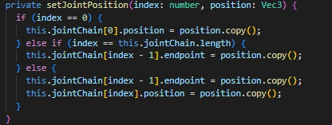

        *   
        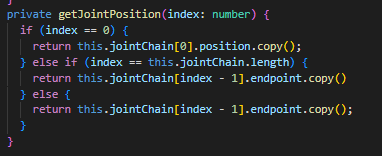

*   Find a way to visualize and intersect the end effectors

    *   Created and rendered a unit sphere (pain), and put it at all the end effector positions

        *   Used [http://www.songho.ca/opengl/gl\_sphere.html#:~:text=In%20order%20to%20draw%20the,triangle%20strip%20cannot%20be%20used](https://www.google.com/url?q=http://www.songho.ca/opengl/gl_sphere.html%23:~:text%3DIn%2520order%2520to%2520draw%2520the,triangle%2520strip%2520cannot%2520be%2520used&sa=D&source=editors&ust=1652162192520766&usg=AOvVaw2CXjew5YpOteQYQ6oYQ8bp) as reference.

        *   results:  
        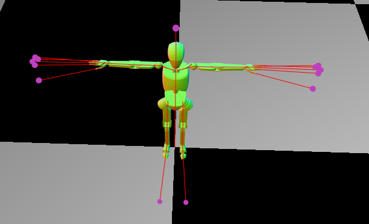

    *   Find when mouse intersects end effector

        *   Sphere intersection logic  
        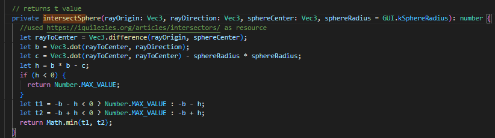

    *   Highlight intersected end effector with gridded lines

        *   Needed extra unit sphere, renderpass, shader, and logic for the gridded lines around the intersected end effector
        *   results:  
        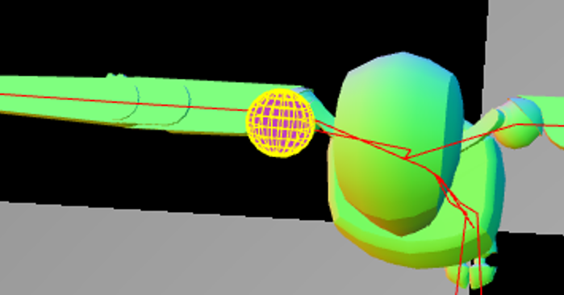

*   Find way to tell end effector where I want it to go

    *   When dragging an end effector, targetPos = p  + v \* (most recently calculated t value when calculating end effector intersection)
    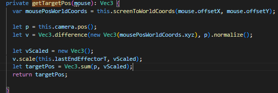
    *   Results:  
    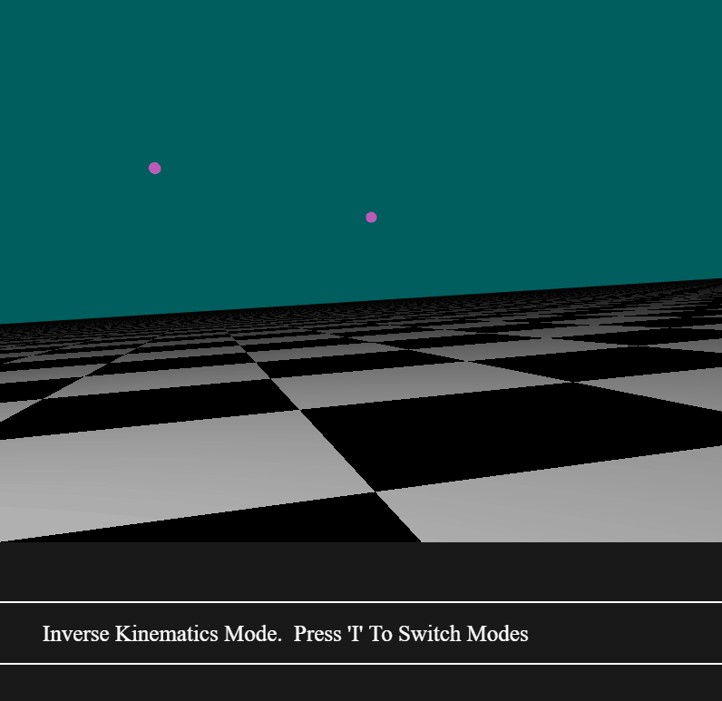

*   Implement FABRIK

    *   Used [http://andreasaristidou.com/publications/papers/FABRIK.pdf](https://www.google.com/url?q=http://andreasaristidou.com/publications/papers/FABRIK.pdf&sa=D&source=editors&ust=1652162192523135&usg=AOvVaw3x9pg_mxPDxrt2gmu5HdtM) as main reference
    *   Code is inverseKinematicsTranslation(targetPos) in Scene.ts
    *   Results:  
    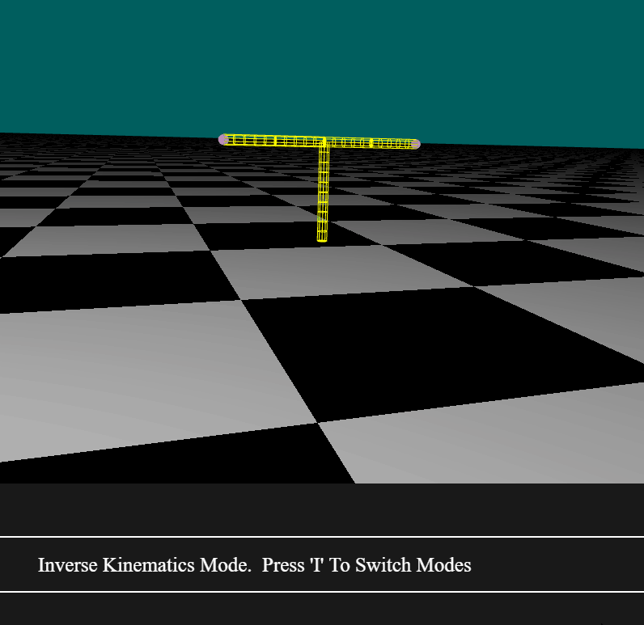  
    

*   Fix branching issue

    *   FABRIK doesn’t handle branching (updating positions of bones not in the joint chain)
    *   I’m handling this by setting all children’s positions to their parents endpoint at the end of an IK iteration

        *   This works for most scenes, but breaks if the scene has disconnected bones (such as the mannequin and the head). I tried to remedy this, but didn’t have enough time to find a good solution.

    *   Results:  
    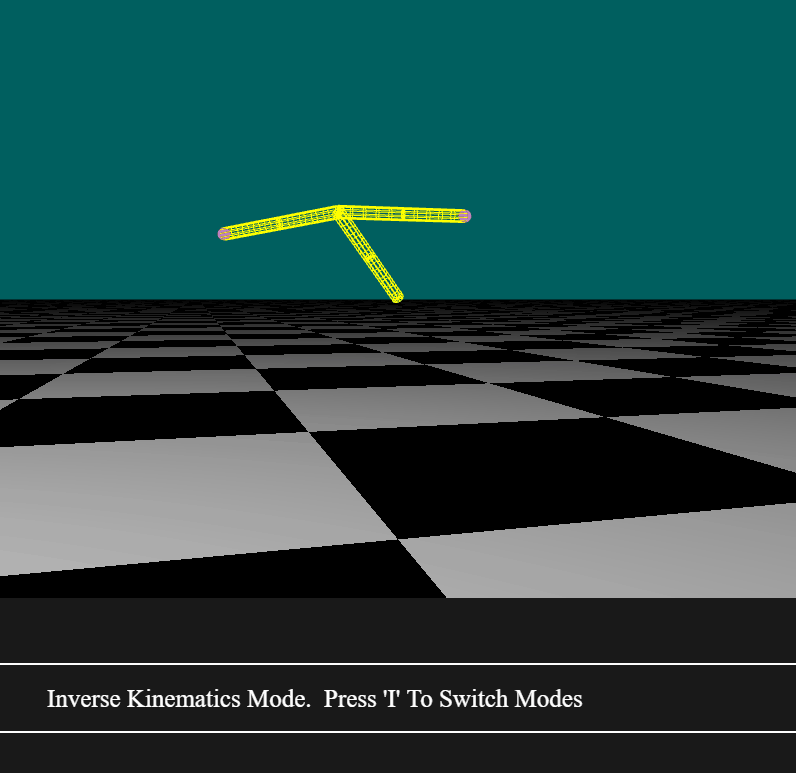

*   Get Quaternion calculations working

    *   This is what the professor and I were discussing for quite a while.
    *   The solution ended up being quite simple:  
    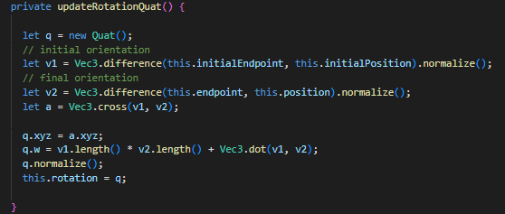  
    Used [https://stackoverflow.com/questions/1171849/finding-quaternion-representing-the-rotation-from-one-vector-to-another](https://www.google.com/url?q=https://stackoverflow.com/questions/1171849/finding-quaternion-representing-the-rotation-from-one-vector-to-another&sa=D&source=editors&ust=1652162192524907&usg=AOvVaw3obt6hFo0uSolKQgSxOu2O) as reference
    
   
    
    
    *   Results:  
    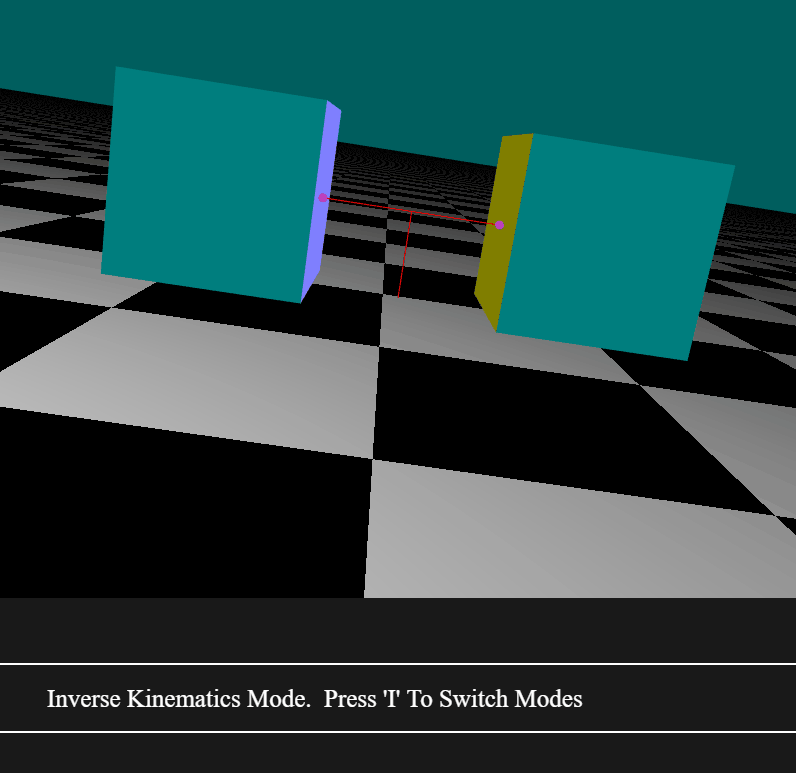

*   Bugs/limitations

    *   My current bone branching implementation assumes bones/joints are connected, which isnt always the case (mannequin and head scene).

        *   So the bones snap together when they shouldnt
        *   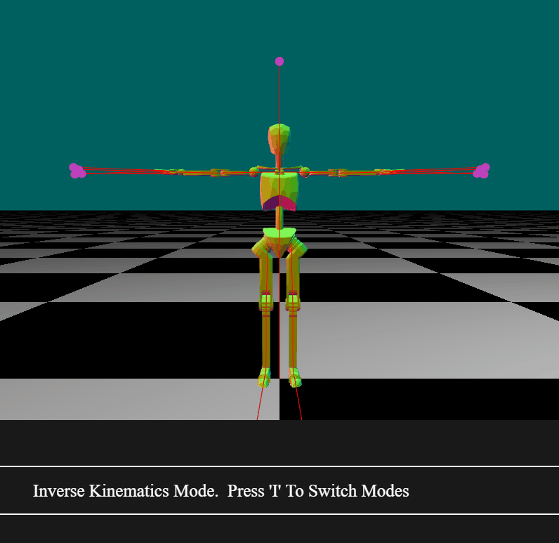
        *   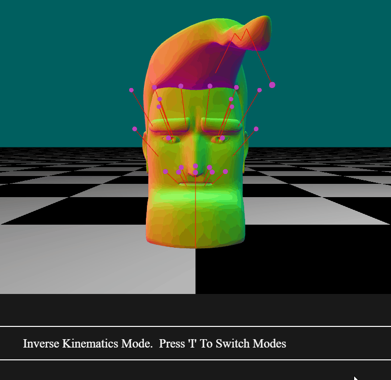

    *   Didn’t have time to implement angle constraints (so rotations on mannequin look unrealistic)

        *   

*   Codebase difficulties

    *   A4 is extremely difficult to deal with due to needing render passes and shaders for everything (rendering the sphere/gridded lines around the sphere alone was quite painful)
    *   A4 has bones, not joints, so had to add extra logic and abstractions to represent that
    *   FABRIK expects a single chain, not branching, which is required for A4 models
    *   FABRIK expects connected joints, but A4 models have separated joints (not enough time to fix this, unfortunately)
    *   I hate quaternions (that issue alone took forever, yet the solution was so simple ;-;)
